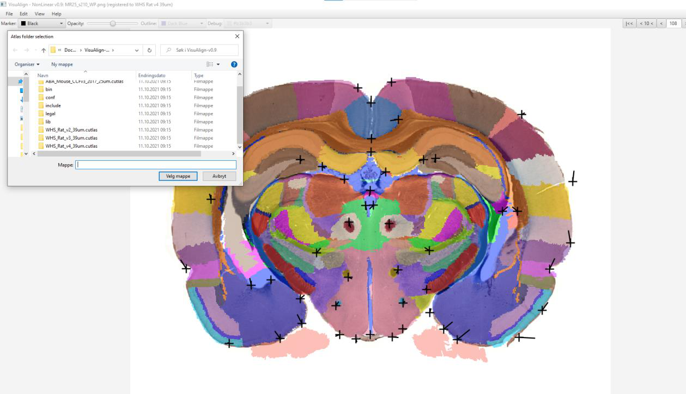

**Change of atlas version**
---------------------------------
As the atlas templates are identical for the Waxholm Space Atlas of the Sprague Dawley rat, you can change delineation version by clicking “Edit”, then on the atlas version.

.. image:: a2e4586e8dc145d5bfdcaec7c21ac926/media/image9.png
   :width: 6.30139in
   :height: 3.85168in

-A new window will open allowing you to navigate to another atlas version.

-Give a new name and save the new Json file.

**Note!** For the Allen mouse atlas, you can also change from CCFv3-2015 to CCFv3_2017 delineations.
