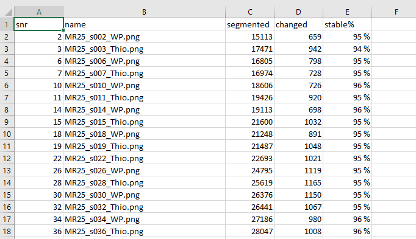

**Export of flat files for the QUINT workflow**
 --------------------------------------------------

There is an “Export” function for generating .flat files for Nutil (.png-s are created too).
A message will appear when the export is completed.

.. image:: a2e4586e8dc145d5bfdcaec7c21ac926/media/image11.png 
  :width: 3.61667in 
  :height: 2.04242in 
  
The export also generates a “report.tsv” file that can be opened in Excel.
This shows how many pixels have been affected in the non-linear process.
The stable % number gives you an average of how far the QuickNII output was from the non-linear correction,
considering the non-linear correction to be the best situation (100%). 
 

 
