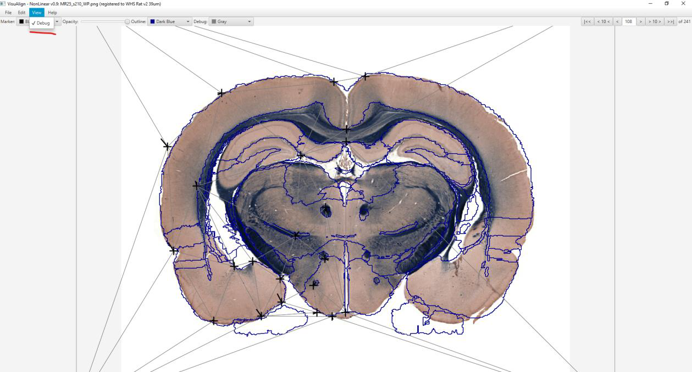

**Working with markers**
-------------------------------

.. image:: a2e4586e8dc145d5bfdcaec7c21ac926/media/image6.png
      :width: 6.30139in
      :height: 3.40345in

- New markers are added under the mouse cursor by pressing the Space bar                                   
- Nonlinear distortions are applied by dragging a marker using the mouse                                                  
- Press Delete or Backspace to remove a marker under the mouse cursor                                     
- A good strategy is to place markers around the contour of the section first, and then proceed with refining the inner parts.
- Markers can and should be used to pin/surround locations that should not be affected by further modifications.       
- The default marker color is black, but it can be changed using the first color picker (near to the top-left corner of the application window)                                    
- Try to keep the number of markers to a minimum.          
- The markers are saved automatically, allowing you to go back to previous section images.                         

The outline mode is toggled by pulling the opacity slider to the far right (as seen in the screenshot). A color picker becomes active for changing the outline color.
“Debug mode” displays triangles representing the deformation field: it is enabled from the View menu (and also enables a color picker for changing the color of the triangles).

