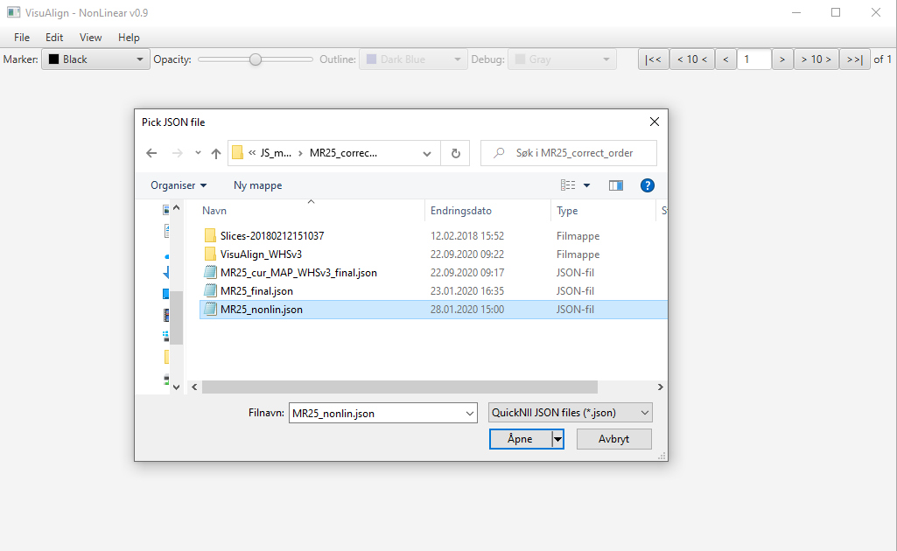

**1. Open VisuAlign and load the data**
----------------------------------------
Open tool by clicking on “VisuAlign.bat” file. It loads and saves JSON files created by QuickNII,

- File, Open, and choose your JSON file.

**Note:** Use the same folder as QuickNII with your png images and
series descriptor (xml file). You will need the JSON version of the
descriptor (it is generated in QuickNII by clicking **“Save JSON”**).

**Note**: The JSON file generated by VisuAlign can be opened in QuickNII if you’ll to correct an AP position.
The additional nonlinear marker points will not be deleted. Save new adjustments in JSON format only.

     
     
